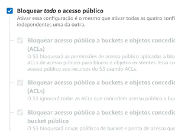
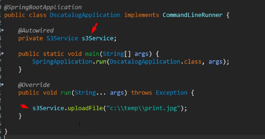
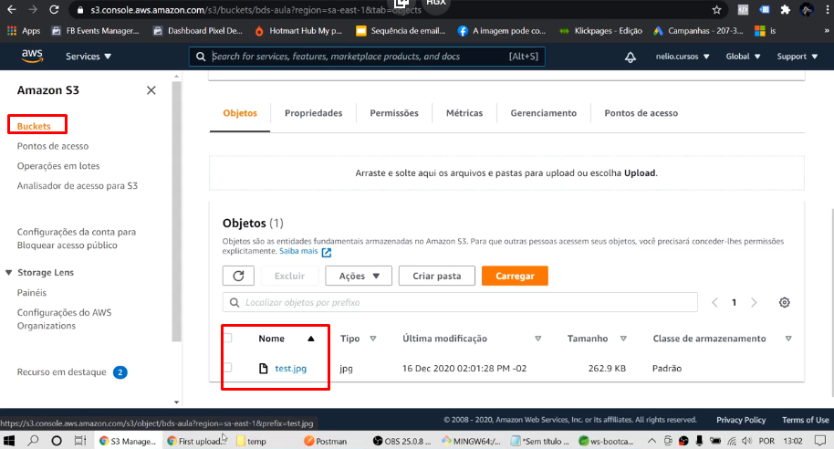
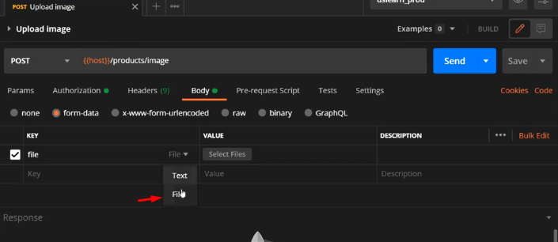
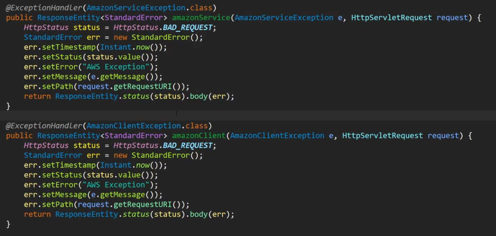
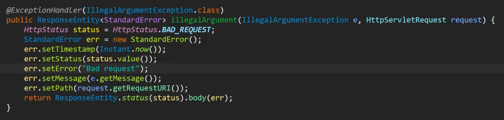
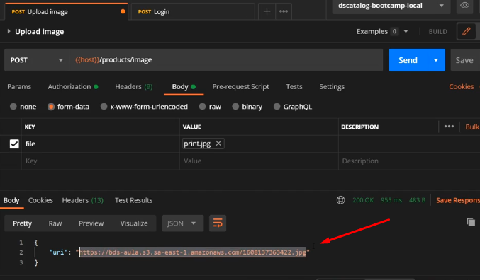

<p align="center">
  
</p>

# Objetivo

Fazer upload de arquivos com S3 da amazon.

# Passo a passo

1. Criar conta na AWS
2. Entrar [neste](https://github.com/devsuperior/dscatalog-resources/blob/master/backend/MISC.md) repositório e seguir
passos

A partir disso:

1. Incluir dependência
2. Fazer cadastro na AWS
3. Configurar IAM

IAM é o serviço central da AWS que gerencia a segurança da nossa conta.

Para configurar IAM:

1. Ir em groups > new group > coloca política de acesso "AmazonS3FullAccess".
2. Criar usuário para ser incluído no grupo acima > users > add user > nome = "curso-spring-ionic-user" >
nas permissões, colocamos ele no grupo.

Ao criarmos um user, ele terá uma chave de acesso e uma chave secreta de acesso. Nós podemos baixar um ".csv" com esses
dados (só pode uma vez, depois não pode mais). Portanto, baixa e deixa salvo em um local seguro.

Agora, configuraremos nosso bucket no S3.

Acessaremos a AWS e iremos no serviço "S3" > criar bucket > nomear > região deixa america do sul (sp) sa-east-1.

As configurações deixa padrão e desbloqueia a opção de bloquear acesso público (para acessarmos uma imagem, por exemplo).



Versionamento, tag, criptografia deixa tudo desativado > criar bucket!

Entra no bucket criado e agora iremos configurar com o que está dentro do repositório git lá de cima.

Iremos definir uma política para ele (um acesso de leitura público).

#### Política de bucket

```json
{
    "Version": "2012-10-17",
    "Statement": [
        {
            "Sid": "PublicReadGetObject",
            "Effect": "Allow",
            "Principal": "*",
            "Action": "s3:GetObject",
                                /*aqui coloca o nome do nosso bucket*/
            "Resource": "arn:aws:s3:::nome-do-bucket/*"
        }
    ]
}
```

Para colocar isso é só ir editar política do bucket em permissões.

Precisamos também configurar o CORS.

#### CORS

Vai em S3 > permissões > CORS > editar > colocar JSON abaixo.

```json
[
    {
        "AllowedHeaders": [
            "*"
        ],
        "AllowedMethods": [
            "GET",
            "HEAD"
        ],
        "AllowedOrigins": [
            "*"
        ],
        "ExposeHeaders": [],
        "MaxAgeSeconds": 3000
    }
]
```

# Variáveis de ambiente, primeiro teste de upload

```.properties
aws.access_key_id=${AWS_KEY:empty}
aws.secret_access_key=${AWS_SECRET:empty}
s3.bucket=${DSCATALOG_BUCKET_NAME:empty}
s3.region=${DSCATALOG_BUCKET_REGION:sa-east-1}

spring.servlet.multipart.max-file-size=${MAX_FILE_SIZE:10MB}
spring.servlet.multipart.max-request-size=${MAX_FILE_SIZE:10MB}
```

Como sabemos, nunca colocamos no nosso projeto as variáveis, precisamos externalizá-las com variáveis de ambiente.

As duas primeiras propriedades (access_key e secret_key), são aquelas duas que são geradas ao criarmos um usuário.

O bucket e region nós precisamos ir no S3 > bucket que foi criado.

Bucket é o nome que criamos.

Sua region é a sa-east-1.

Para settar é o que já sabemos, ir em variáveis de ambiente e criar.

1. AWS_KEY
2. AWS_SECRET
3. DS_DATALOG_BUCKET_NAME
4. DS_CATALOG_BUCKET_REGION

Fez isso? Reinicia o STS.

# S3Service

Criaremos um S3Service e colocaremos tudo que está la no repositório do git.

❗❗️ Esse código irá mudar quando formos criar o endpoint. ⬇️

```java
@Service
public class S3Service {

	private static Logger LOG = LoggerFactory.getLogger(S3Service.class);

    //componente do SDK Amazon
	@Autowired
	private AmazonS3 s3client;

    //pegando nome do do bucket do properties
	@Value("${s3.bucket}")
	private String bucketName;

    //fará um upload de arquivo dada uma localização do nosso computador
	public void uploadFile(String localFilePath) {
		try {
			File file = new File(localFilePath);
			LOG.info("Upload start");
            
            //isso faz o upload para o S3
			s3client.putObject(new PutObjectRequest(bucketName, "test.jpg", file));
			LOG.info("Upload end");
		}
		catch (AmazonServiceException e) {
			LOG.info("AmazonServiceException: " + e.getErrorMessage());
			LOG.info("Status code: " + e.getErrorCode());
		}
		catch (AmazonClientException e) {
			LOG.info("AmazonClientException: " +  e.getMessage());
		}
	}
}
```

Para isso tudo funcionar, precisamos definir um Bean para dizer como o AmazonS3 vai ser instanciado.

Ele vai ser instanciado usando as credenciais do properties (access_key e secret_access_key e region).

Para isso, iremos criar um S3Config:

## S3Config

```java
@Configuration
public class S3Config {

	@Value("${aws.access_key_id}")
	private String awsId;

	@Value("${aws.secret_access_key}")
	private String awsKey;

	@Value("${s3.region}")
	private String region;

	@Bean
	public AmazonS3 s3client() {
        //passando access_key e secret_access_key
		BasicAWSCredentials awsCred = new BasicAWSCredentials(awsId, awsKey);
		AmazonS3 s3client = AmazonS3ClientBuilder.standard().withRegion(Regions.fromName(region))
							.withCredentials(new AWSStaticCredentialsProvider(awsCred)).build();
		return s3client;
	}
}
```

## Testando na Application

Criar um JPG qualquer e colocar em uma pasta.

Se quiser testar no Application, inicia um CommandLineRunner, faremos o seguinte:



Agora no nosso bucket, a ideia é que o arquivo esteja lá:



## Upload pelo endpoint

### Postman

Criar um POST com o nome "Upload image", por exemplo. 

URL: ``{{host}}/products/image``

Authorization: Bearer token, somente user logado.

Body: Dessa vez não vai ser JSON (raw) vai ser form-data! Ficará assim:



Lembrar de trocar de text para file ⬆️

E a resposta? Bom, o nosso backend pegue esse arquivo, salve no S3 e nos devolva a URL do arquivo salvo!

### Criando lógica backend

#### DTOS

Criar um DTO (FileDTO) para receber essa file do postman.

```java
public class FileDTO {
    
    //referenciando ao file do postman
    private MultiPartFile file;
    
    public FileDTO() {}
    
    //getters and setters
}
```

Agora, precisamos criar um DTO para retornar o caminho do arquivo salvo.

```java
public class UriDTO {
    
    private String uri;
    
    public UriDTO() {}
    
    //construtor com argumento + getters and setters
}
```

#### Endpoint

##### Controller

No ProductController criar o endpoint, veja:

```java
@PostMapping(value = "/image") //RequestParam consegue reconhecer o "file" do postman
public ResponseEntity<UriDto> uploadImage(@RequestParam("file") MultiPartFile file) {
    UriDTO dto = service.uploadFile(file);
    return ResponseEntity.ok().body(dto);
}
```

##### Service

Lembra do S3Service? Nós iremos mexer nele, veja:

No início do try iremos fazer algumas lógicas.

1. Pegar o nome original do arquivo (originalName)
2. Pegar a sua extensão (extension)
3. Pegar o nome do arquivo upado no S3. O nome dele será o instante atual em milissegundos + a sua extension

4. Para enviar o objeto para O S3 com MultiPartFile usaremos o InputStream.
5. Pegar o contentType do arquivo
6. E colocar para retornar o método uploadFile() (que criaremos abaixo)

```java
@Service
public class S3Service {

    private static Logger LOG = LoggerFactory.getLogger(S3Service.class);

    //componente do SDK Amazon
    @Autowired
    private AmazonS3 s3client;

    //pegando nome do do bucket do properties
    @Value("${s3.bucket}")
    private String bucketName;

    //agora o método retorna URL e recebe um MultiPartFile
    public URL uploadFile(MultiPartFile file) {
        try {
            String originalName = file.getOriginalFilename();
            //pegando extensao do arquivo com o apache IO
            String extension = FilenameUtils.getExtension(originalName);
            
            //gerando nome padrão pros arquivos (correspodente ao instante que ele foi
            //upado
            String fileName = Instant.now().toDate().getTime() + "." + extension;
            
            //isso pode gerar uma IOException
            InputStream is = file.getInputStream();
                    
            //é um jpg/png? ele nos dirá isso
            String contentType = file.getContentType();
            
            //essa função chama o upload no S3 e retorna a URL
            return uploadFile(is, fileName, contentType);
            
        }
        //deixa só esse catch porque pode ter algum
        //erro de digitação no input
        catch (IOException e) {
            throw new IllegalArgumentException(e.getMessage());
        }
    }
    
    private URL uploadFile(InputStream is, String fileName, String contentType) {
        ObjectMetadata meta = new ObjectMetadata();
        meta.setContentType(contentType);
        
        //aqui ele faz o upload no s3 pra gente
        s3client.putObject(bucketName, fileName, is, meta);
        
        //para retornar URL no bucket do AWS
        return s3client.getUrl(bucketName, fileName);
    }
}
```

##### Exceptions

Tiramos as exceptions do try e colocamos no tratamento (do ControllerAdvice)



❗Tratando IllegalArgument



##### ProductService

❗ Lembrar de injetar S3Service.


```java
public UriDto uploadFile(MultiPartFile file) {
    URL url = s3Service.uploadFile(file);
    return new UriDto(url.toString());
}
```

## FINAL

1. Faz o login no Postman
2. Vai na requisição de Upload, o valor você seleciona o arquivo
3. Envia a requisição



Repare que o nome é exatamente o que fizemos no service.